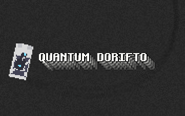

# Quantum Dorifto



A game about drift made for the 
[4mb Game Jam](https://itch.io/jam/4mb-jam-2023)

## Building

You need Potetre2D executable in the same directory as the project:
```bash
$ git clone https://github.com/SheatNoisette/potetre2d.git
$ cd potetre2d;./bootstrap.sh && make compress
$ cd ..
$ make run
```
The game was made using the `b150` tag of the Engine and may
not work with later version of the engine.

## License
Assets in the `src\assets` folder are under Creative Commons
Attribution-ShareAlike 4.0 International except `smg_fire.ogg`
which is under CC BY 4.0.

The code is under GPLv3-only, see `LICENSE` file for more
information.
